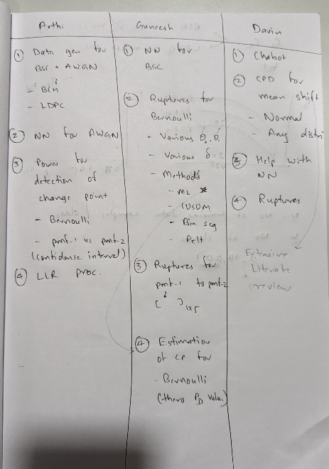

 ## 29th July, 2025

1. Implementation of Ruptures Methods, MLE, CUSUM, Hinkley's Paper Results 
2. Discussion - BCH Codes and LDPC Codes 
3. Power of the test - (2 Paper and 1 Book : Reference Shared) & Value of w(h) in our case. 
4. Below is the image of tasks divided among the team. 
5. Neural Network approach
    - Size of the sequence - 5, 10, 20
    - Length of the codeword - 15, 31, 63

6. For NN - Plot Pd(performance of trained NN) vs N(number of samples needed per class)
7. Plot Pd vs N or N*W --- to see for which min N : performance of the model reaches max also Pd vs reducing crossover probabilities (For a fixed length N of the sequence)
8. Read more relevant papers for DL architectures - our codes specific
9. Chabot Paper - Davin 
10. LLR processing, LDPC Codes generation - Arthi 

