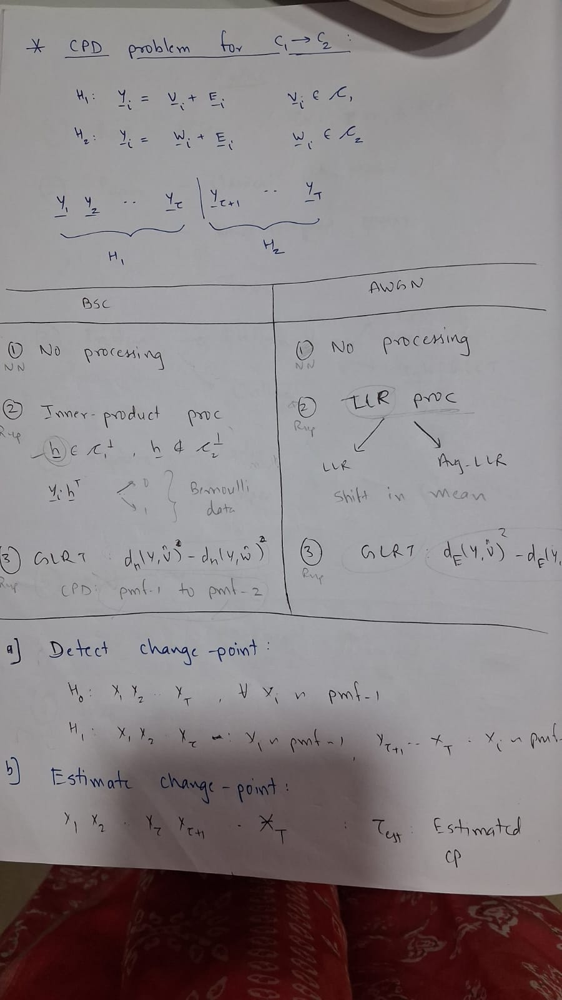
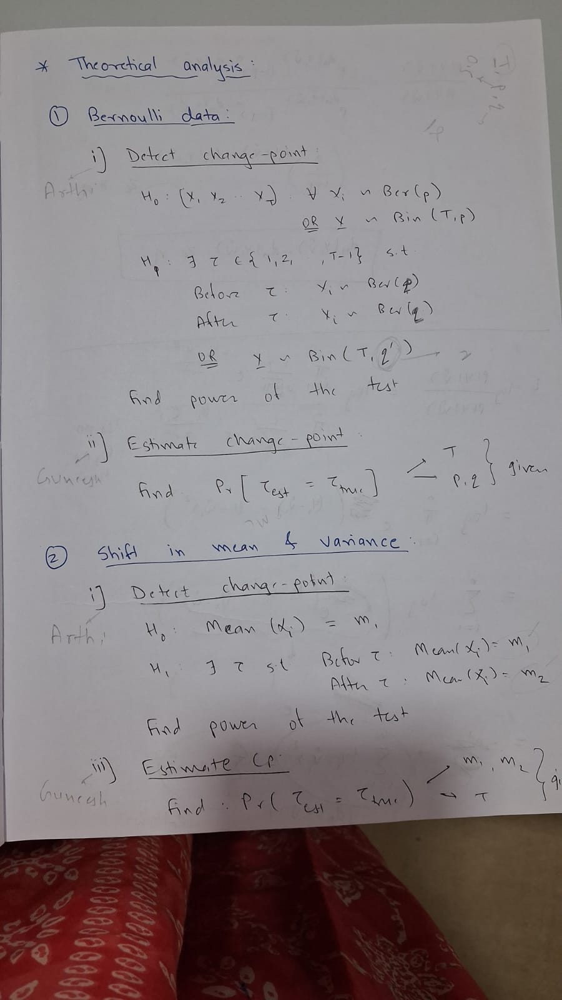

# Offline Changepoint Detection in Channel Codes

This repository tracks the progress of my research project on offline changepoint detection in channel codes. 

---

## Table of Contents
- [Overview](#Overview)
- [Literature Review](#Literature-Review)
- [Code Progress](#Code-Progress)
- [Target Conferences/Journals](#Target-Conferences/Journals)
- [Presentations/Progress](#Presentations)
- [Research Paper Drafts](#Research-Paper-Drafts)
- [Extra Resources and Links](#Extra-Important-Resources-and-Links)
- [References](#References)


---

## Overview

Offline changepoint detection is critical in identifying shifts in data behavior, particularly within channel codes. This repository serves as a record of the research process, tracking progress through: 

--- 
## Literature Review
Link of the Sheet where I am tracking the current updated list of Papers/Books/Resources being used for this project - [Link](https://docs.google.com/spreadsheets/d/1NH3iFS4BFo1hTYis5-IdWirP7EWbnc5gohk_1H-MvWg/edit?gid=0#gid=0)


Below is a curated list of key papers and books, along with links for deeper reference.
It is only a partial list rest of it is in the sheet link above. 

| **S.No** | **Title**                                                                           | **Link**                                                                                                 |
| -------- | ----------------------------------------------------------------------------------- | ------------------------------------------------------------------------------------------------------- |
| 1        | **Paper - 1:** Selective Review of Offline Changepoint Detection Methods            | [View Paper](https://www.sciencedirect.com/science/article/pii/S0165168419303494)                       |
| 2        | **Paper - 2:** Automatic Change-Point Detection in Time Series via Deep Learning (Arthi)   | [View Paper](https://arxiv.org/abs/2211.03860)                                                          |
| 3        | **Paper - 3:** Inference About the Change-Point in a Sequence of Binomial Variables (1970) | [View Paper](https://www.jstor.org/stable/2334766)                                                                                          |
| 4        | **Paper - 4:** A Test for a Change in a Parameter Occurring at an Unknown Point (1955)     | [View Paper](https://academic.oup.com/biomet/article-abstract/42/3-4/523/296358)                                                                                          |
| 5        | **Paper - 5:** Nonparametric Changepoint Analysis for Bernoulli Random Variables Based on Neural Networks (Thesis) | [View Paper](https://kluedo.ub.rptu.de/frontdoor/deliver/index/docId/2032/file/Final_Draft_October_14102008.pdf)      |
| 6        | **Paper - 6:** A Simple cumulative sum type statistic for the change-point problem with zero-one observations (Arthi, 1980) | [View Paper](https://www.jstor.org/stable/2335319)      |
| 7        | **Book - 1:** Detection of Abrupt Changes: Theory and Application                   | [Chapter 2, 3.1](https://people.irisa.fr/Michele.Basseville/kniga/kniga.pdf)                            |
| 8        | **Book - 2:** Error Control Coding: Fundamentals and Applications                   | [View Book](https://pg024ec.wordpress.com/wp-content/uploads/2013/09/error-control-coding-by-shu-lin.pdf)|
| 9        | **Book - 3:** Fundamentals of Statistical Signal Processing                         | [View Book]()                                                                                           |
| 10        | **Paper - 7:** Bayesian Approach to Inference About a Changepoint in a Sequence of Random Variables (1975)                         | [View Paper](https://www.jstor.org/stable/2335381?refreqid=fastly-default%3A81fef0d7415e79e63875176c864c8f65&seq=2)                                                                                           |
| 11        | **Book - 4:** An introduction to signal detection and estimation, Vicent Poor | [View Book]() 

---

## Code Progress 

This section tracks the coding and experimentation journey for this project. Here, I document each method tried, the comparative insights gained, and the rationale behind choosing or discarding certain algorithms:

### For Processed Data : (Bernoulli Data) 
- When Ber parameters are known to us
1. MLE 
2. CUSUM 

- When Parameters are not known
1. BinSeg + Bernoulli CF 
2. PELT


For PMF1-PMF2 : 
(On Hold for now) 

### For Unprocessed Data : 

#### For Neural Network Type - I (Distinct Neural Networks), Approach-I  
```
Type I : NN are trained on only one values of p (BSC parameter) codewrords
Approach I : 1DCNN with Res Block and Adaptive Pooling 
```
1. T=5, p {0.01, 0.05, 0.1, 0.2}, Codeword Length = 15 : [Link](https://www.kaggle.com/code/guneeshvats/cl-15-t-5-approach-1)
2. T=7, p ∈ {0.01, 0.05, 0.1, 0.2}, Codeword Length = 15 : [Link](https://www.kaggle.com/code/guneeshvats/cl-15-t-7-approach-1)
3. T=10, p ∈ {0.01, 0.05, 0.1, 0.2}, Codeword Length = 15 : [Link](https://www.kaggle.com/code/guneeshvats/cl-15-t-10-approach-1)
4. T=5, p ∈ {0.01, 0.05, 0.1, 0.2}, Codeword Length = 31 : [Link](https://www.kaggle.com/code/guneeshvats/cl-31-t-5-approach-1)
5. T=7, p ∈ {0.01, 0.05, 0.1, 0.2}, Codeword Length = 31 : [Link](https://www.kaggle.com/code/guneeshvats/cl-31-t-7-approach-1)
6. T=10, p ∈ {0.01, 0.05, 0.1, 0.2}, Codeword Length = 31 : [Link](https://www.kaggle.com/code/guneeshvats/cl-31-t-10-approach-1)
4. T=5, p ∈ {0.01, 0.05, 0.1, 0.2}, Codeword Length = 63 : 
6. T=7, p ∈ {0.01, 0.05, 0.1, 0.2}, Codeword Length = 63 : 
7. T=10, p ∈ {0.01, 0.05, 0.1, 0.2}, Codeword Length = 63 : 

#### Neural Network ; Type - II (Diverse Neural Networks), Approach-I 
```
Type II : Model is trained on seqeuences of a fixed Lenght but many types of BSC parameter {0.001, 0.005, 0.01, 0.05, 0.1}
Approach I : 1DCNN with Res Block and Adaptive Pooling 
```
Purpose here is, What if we don't know the value of 'p' for the codewords in that case we use this Neural Network 

1. T = 5, p ∈ {0.001, 0.005, 0.01, 0.015, 0.02, 0.025, 0.03, 0.035, 0.04, 0.045, 0.05}, Codeword Length = 15 : [Link](https://www.kaggle.com/code/guneeshvats/type2-cl-15-t-5)
2. T = 7, p ∈ {0.001, 0.005, 0.01, 0.015, 0.02, 0.025, 0.03, 0.035, 0.04, 0.045, 0.05}, Codeword Length = 15 : 
3. T = 10, p ∈ {0.001, 0.005, 0.01, 0.015, 0.02, 0.025, 0.03, 0.035, 0.04, 0.045, 0.05} Codeword Length = 15 : 
4. T = 5, p ∈ {0.001, 0.005, 0.01, 0.015, 0.02, 0.025, 0.03, 0.035, 0.04, 0.045, 0.05} Codeword Length = 30 : 
5. T = 7, p ∈ {0.001, 0.005, 0.01, 0.015, 0.02, 0.025, 0.03, 0.035, 0.04, 0.045, 0.05} Codeword Length = 30 : 
6. T = 10, p ∈ {0.001, 0.005, 0.01, 0.015, 0.02, 0.025, 0.03, 0.035, 0.04, 0.045, 0.05} Codeword Length = 30 : 

Plots of Neural Networks : 
1. Accuracy vs N'
2. Accuracy vs N'
3. Accuracy vs p
4. Accuracy vs T 
---

Comparative Plots to these Neural Networks : 
1. For Type I : MLE, CUSUM / NN         Accuracy vs {fixed T/p} - whichever is not fixed - will be X-Axis
2. For Type II : BinSeg, PELT / NN      Accuracy vs {fixed T/p}


## Target Conferences/Journals
1. ITW [Link]() - April 
2. GlobComm [link]() - April 1 
3. WCNC [Link](https://wcnc2026.ieee-wcnc.org/group/21) - 14th September, 2026 
4. IEEE ICC [Link](https://icc2026.ieee-icc.org/) - September last week - 2026 
5. Journal IEEE Comm Letters [Link](https://www.comsoc.org/publications/journals/ieee-comml/ieee-communications-letters-submit-manuscript) 
6. NCC - December 
7. COMSNET 


---
## Presentations

Below are links to draft documents related to the project’s progress and literature review insights:

1. **Selective Review of Offline Changepoint Detection Methods and Derivation of Pd**: [Google Slides Draft](https://docs.google.com/presentation/d/1yzx00AFN8aDG7L4OdEDbvaQSgfRj37CbkmYR_34oxAI/edit#slide=id.p)
2. Book : Detection of abrupt changes - 1 : [Link](https://docs.google.com/presentation/d/1PnksHSrUnm4IxZZjZRDIiH2pTVHfskBcWiLQSv_T2x0/edit?usp=sharing)
3. Book : Detection of abrupt changes - 2 : [Link](https://docs.google.com/presentation/d/1iXaYZVFk-exzLrhFkULLsp9rYov2lKB-wqtYYZgmQAg/edit?slide=id.g365fba041ae_0_227#slide=id.g365fba041ae_0_227)
4. Fundamentals Presentation (Stephen M Kay) : Chapter 3 : Fundamentals of Statistical Signal Processing Vol-II Detection Theory - [Google Sheets](https://docs.google.com/presentation/d/1lgZ_AjC37yOn1BTG8N3TQjbQZ_DMGhDRBksqX38kGpw/edit?slide=id.p#slide=id.p) 
5. David Hinkleys Paper - 1970 - [Link](https://docs.google.com/presentation/d/10IOkuVqAIMPgPNODWeXjyfC6MruyAOy3SdZtoe14s8A/edit?slide=id.p#slide=id.p)
6. Bayesian Approach to Inference about a changepoint : [Link](https://docs.google.com/presentation/d/1kav9KW3tlR1cqhAe5ZjEAPWfs7MjHPLMCOK41FYLdz4/edit?slide=id.p#slide=id.p)


Results : 

1. Preliminary Results - 1 Processed Data Analysis Results using Ruptures - [Link](https://docs.google.com/presentation/d/1wyRNPNR1VTmX5hlMlGAFHBnWoSIPuzE6qKK-2E9-rkI/edit?usp=sharing)
2. Preliminary Results - 1 Unprocessed Data - Approach 1 (1DCNN with Res block and adaptive pooling) - [Link](https://docs.google.com/presentation/d/1KcciWTHpWIijZlj-yCmJKgQ4REtyWrCr6Z5-QIe8WD8/edit?usp=sharing)
3. Implementation of Hinley's Paper - [Link]()

---
## Research Paper Drafts
1. Sample Draft - [Link](https://www.overleaf.com/8349162991grcjytshyrqg#9cd545)

---
## Code Progress : 
1. Data Generation Code (MATLAB)
2. Unprocessed Codewords Data : NN (1dCNN), Transformers
3. Processed Data : Ruptures and python Libraries
4. Implementation of the Hinkley's Recursive Formulation
---

## Extra Important Resources and Links
1. CPD Project Related Topics and Research Papers List to be done - [Link](https://docs.google.com/spreadsheets/d/1NDgSKFA3LEqDTNt4PL07NPiguZQqH2xJB_vK9ANAU-A/edit?gid=0#gid=0)


Idea of the Project : 



